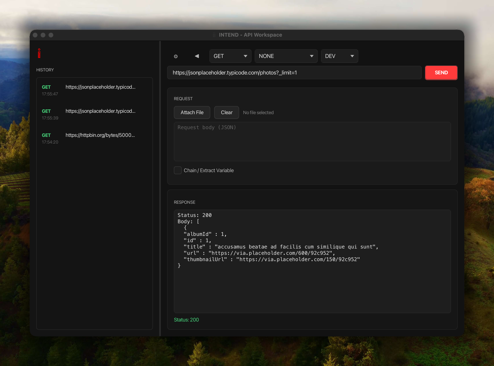
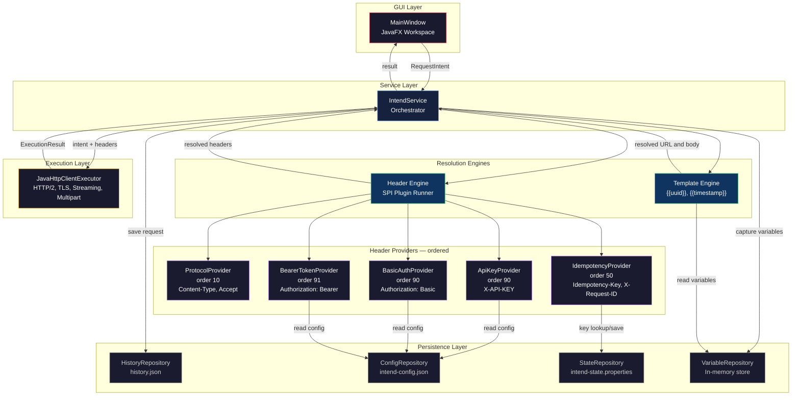
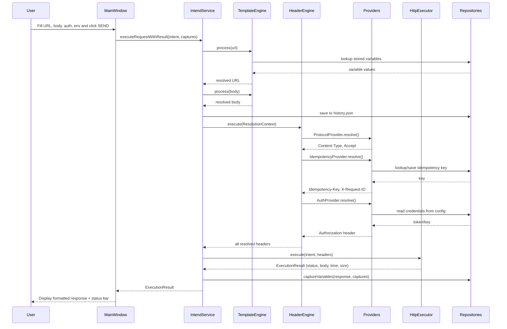
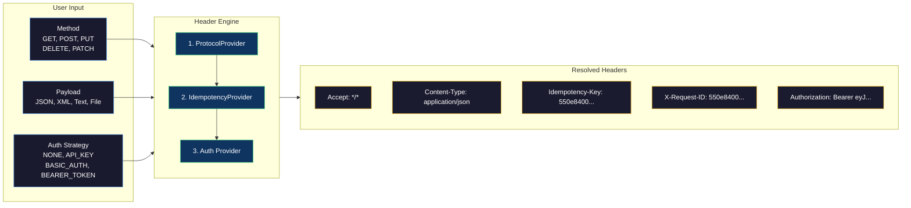

<p align="center">
  
</p>

<h1 align="center">INTEND</h1>

<p align="center">
  <strong>The intent-driven API workspace. Say what you want — not how to get it.</strong>
</p>

<p align="center">
  
  
  
  
  
  
</p>

<p align="center">
  <a href="#-quick-start">Quick Start</a> · <a href="#-why-intend">Why Intend</a> · <a href="#-the-workspace">The Workspace</a> · <a href="#-features">Features</a> · <a href="#-installation">Installation</a> · <a href="#-architecture">Architecture</a>
</p>

---

## The Problem

Every API workspace today forces you to think like a protocol engineer. You manually construct headers, paste auth tokens into every request, and hope you didn't accidentally fire a duplicate payment.

Intend takes a different approach: **you describe your intent, and the app handles the protocol.**

Select `POST`, choose `Bearer Token` from a dropdown, type your URL, write your JSON body, and hit **SEND**. Intend automatically resolves `Content-Type`, `Authorization`, `Idempotency-Key`, and `X-Request-ID` — no raw headers, no guesswork.

---

## Why Intend

<table>
<tr>
<td width="50%">

### Traditional API Clients

- You write raw headers manually
- You copy-paste auth tokens into every request
- No duplicate-request protection
- Content-Type is your responsibility
- Variables require scripting
- Electron-based, requires an account

</td>
<td width="50%">

### Intend

- Headers resolved from your intent automatically
- Auth strategy selected from a dropdown — once
- Built-in idempotency keys for POST/PUT/PATCH
- Content-Type auto-detected from payload shape
- Template variables and response chaining built in
- Native JavaFX — no browser, no account, fully offline

</td>
</tr>
</table>

### Head-to-head comparison

| Capability | Postman | Insomnia | Thunder Client | **Intend** |
|---|---|---|---|---|
| Zero-header requests | — | — | — | **Yes** |
| Auto Content-Type detection | — | — | — | **Yes** |
| Built-in idempotency keys | — | — | — | **Yes** |
| Pluggable auth (SPI) | Collection-level | Collection-level | Basic | **Per-request SPI** |
| Response variable capture | Scripts required | Plugin | Limited | **One-click checkbox** |
| Template engine (`{{uuid}}`, `{{timestamp}}`) | `{{$guid}}` | `{{timestamp}}` | — | **Built-in** |
| Native desktop app | Electron | Electron | VS Code ext | **JavaFX native** |
| Offline / no account required | No | No | Yes | **Yes** |
| Open plugin architecture | Limited | Limited | — | **Java SPI** |
| File upload (multipart) | Yes | Yes | Yes | **Yes** |
| Streaming large responses | — | — | — | **Yes** |
| Request history with replay | Yes | Yes | Yes | **Yes — one-click** |
| Environment switching (Dev/Prod) | Yes | Yes | Limited | **Yes — dropdown** |

---

## Quick Start

### Option A — Run from source (30 seconds)

```bash
git clone https://github.com/pskuntal1248/http-client-intend.git
cd http-client-intend
./mvnw spring-boot:run
```

The Intend workspace window opens immediately.

### Option B — Install the native app

Download the installer for your platform from [Releases](https://github.com/pskuntal1248/http-client-intend/releases):

| Platform | Installer | How to install |
|---|---|---|
| macOS | `Intend-1.0.0.dmg` | Open DMG → drag Intend to Applications |
| Windows | `Intend-1.0.0.msi` | Double-click → follow the wizard |
| Ubuntu / Debian | `intend_1.0.0-1_amd64.deb` | `sudo dpkg -i intend_*.deb` |
| Fedora / RHEL | `intend-1.0.0-1.x86_64.rpm` | `sudo rpm -i intend-*.rpm` |

---

## The Workspace

Intend is a single-window workspace with a history sidebar, request editor, and response viewer — all in a native dark-themed interface.

<p align="center">
  
</p>

### Workspace controls

| Element | Location | What it does |
|---|---|---|
| **Method dropdown** | Top bar | Select `GET`, `POST`, `PUT`, `DELETE`, or `PATCH` |
| **Auth dropdown** | Top bar | Select auth strategy: `NONE`, `API_KEY`, `BASIC_AUTH`, `BEARER_TOKEN` |
| **Env dropdown** | Top bar | Switch between `DEV` and `PROD` environments |
| **URL field** | Below top bar | Enter the endpoint URL — supports `{{variables}}` |
| **SEND button** | Right of URL field | Execute the request |
| **Request body** | Center panel | Write JSON, XML, or plain text payloads |
| **Attach File** | Above request body | Select a file for multipart upload |
| **Chain checkbox** | Below request body | Enable variable capture from the response |
| **Capture field** | Below chain checkbox | Define capture rules (e.g. `USER_ID=/id`) |
| **Response viewer** | Lower panel | Displays the formatted response body |
| **Status bar** | Bottom of response | Shows status code, category, time, and size |
| **History sidebar** | Left panel | Lists all previous requests — click to reload |
| **Toggle button (◀▶)** | Top bar | Collapse or expand the history sidebar |
| **Settings button (⚙)** | Top bar | Open environment configuration |

### Color-coded status

The status bar changes color based on the response:

| Status range | Color | Meaning |
|---|---|---|
| `200–299` | Green | Success |
| `300–399` | Yellow | Redirect |
| `400–499` | Red | Client error |
| `500+` | Red | Server error |

### Color-coded methods in history

Each HTTP method is color-coded in the sidebar for quick scanning:

| Method | Color |
|---|---|
| `GET` | Green |
| `POST` | Blue |
| `PUT` | Yellow |
| `DELETE` | Red |
| `PATCH` | Purple |

---

## Features

### 1. Intent-based header resolution

You never write a single header. Intend resolves them from your choices in the workspace:

| What you do in the GUI | What Intend resolves automatically |
|---|---|
| Type a JSON body `{"name": "Alice"}` | `Content-Type: application/json` |
| Type an XML body `<entry>...</entry>` | `Content-Type: application/xml` |
| Type plain text | `Content-Type: text/plain` |
| Leave body empty | No `Content-Type` sent |
| Select `BEARER_TOKEN` from Auth dropdown | `Authorization: Bearer <token>` |
| Select `API_KEY` from Auth dropdown | `X-API-KEY: <key>` |
| Select `BASIC_AUTH` from Auth dropdown | `Authorization: Basic <base64>` |
| Use `POST`, `PUT`, or `PATCH` method | `Idempotency-Key` + `X-Request-ID` added |
| Every request | `Accept: */*` |

All of this happens behind the scenes. The request body area is purely for your data.

---

### 2. Authentication

Select your auth strategy from the **Auth dropdown** in the top bar. Credentials are loaded from your environment configuration — never pasted into individual requests.

| Strategy | Dropdown value | What happens |
|---|---|---|
| No auth | `NONE` | No auth header sent |
| API Key | `API_KEY` | Reads `API_KEY` from config → sends `X-API-KEY` header |
| Basic Auth | `BASIC_AUTH` | Reads `BASIC_USER` + `BASIC_PASS` → sends Base64-encoded `Authorization: Basic` |
| Bearer Token | `BEARER_TOKEN` | Reads `ACCESS_TOKEN` from config → sends `Authorization: Bearer` |

To configure credentials, click the **⚙ Settings** button and enter your keys per environment.

---

### 3. Automatic idempotency protection

Every `POST`, `PUT`, and `PATCH` request automatically gets:

- **Idempotency-Key** — prevents duplicate processing on the server
- **X-Request-ID** — correlates the request across distributed systems

**How it works in the GUI:**

1. Send a `POST` to `https://api.example.com/payments` → Intend generates a new key
2. Send the same `POST` to the same URL again → Intend **reuses** the previous key (safe retry)
3. The server sees the same idempotency key and returns the original response instead of processing twice

No other API workspace does this out of the box. No configuration needed — it just works.

---

### 4. Template variables

Type `{{variables}}` directly into the URL field or request body. Intend resolves them before sending.

**Built-in generators:**

| Variable | What it produces | Example output |
|---|---|---|
| `{{uuid}}` | Random UUID v4 | `550e8400-e29b-41d4-a716-446655440000` |
| `{{timestamp}}` | ISO-8601 instant | `2026-03-02T14:30:00Z` |
| `{{randomInt}}` | Random integer 0–999 | `427` |
| `{{randomEmail}}` | Random email address | `user_3847@example.com` |
| `{{randomUser}}` | Random username | `User42` |
| `{{yourVar}}` | Value captured from a previous response | *(see chaining below)* |

**Example request body:**

```json
{
  "id": "{{uuid}}",
  "email": "{{randomEmail}}",
  "name": "{{randomUser}}",
  "created": "{{timestamp}}"
}
```

Every `{{uuid}}` and `{{timestamp}}` generates a fresh value on each send.

---

### 5. Response chaining and variable capture

Capture a value from one response and use it in the next — no scripting, just a checkbox and a rule.

**Step-by-step:**

1. Check the **"Chain / Extract Variable"** checkbox below the request body
2. In the capture field, type a rule like `USER_ID=/id`
3. Click **SEND** — Intend executes the request and extracts the `/id` field from the JSON response
4. The value is stored as `USER_ID` in the variable repository
5. In your next request, use `{{USER_ID}}` in the URL or body — it resolves automatically

**Full example flow:**

```
Request 1:
  POST https://api.example.com/users
  Body: {"name": "Alice"}
  Capture: USER_ID=/id
  Response: {"id": "abc-123", "name": "Alice"}
  → USER_ID = "abc-123" is stored

Request 2:
  GET https://api.example.com/users/{{USER_ID}}/orders
  → URL resolves to: https://api.example.com/users/abc-123/orders
```

---

### 6. Environment management

Switch between **DEV** and **PROD** using the environment dropdown in the top bar.

Click the **⚙ Settings** button to configure each environment:

| Field | Description |
|---|---|
| DEV URL | Base URL for development (default: `http://localhost:8080`) |
| DEV Key | API key for development environment |
| PROD URL | Base URL for production (default: `https://api.example.com`) |
| PROD Key | API key for production environment |

Configuration is saved to `~/.intend/intend-config.json` and persists across sessions.

---

### 7. Request history

Every request you send is automatically saved to the history sidebar with:

- **Method** — color-coded for quick scanning
- **URL** — truncated to fit the sidebar width
- **Timestamp** — when the request was sent

**Interactions:**

| Action | How |
|---|---|
| Replay a request | Click any history entry — method, URL, and body are loaded into the editor |
| Delete an entry | Right-click the entry → select **Delete** |
| Collapse the sidebar | Click the **◀** toggle button in the top bar |
| Expand the sidebar | Click the **▶** toggle button |

History is persisted to `~/.intend/history.json` and survives app restarts.

---

### 8. File uploads

Upload files via multipart/form-data with zero manual configuration:

1. Click **Attach File** above the request body
2. Select a file from the file picker
3. The request body field shows the selected file path and disables text input
4. The method automatically switches to `POST`
5. Click **SEND** — Intend handles the `multipart/form-data` boundary and `Content-Type`

Click **Clear** to remove the file and return to manual body editing.

---

### 9. Streaming for large responses

Responses over 10 MB are flagged automatically. The executor supports streaming downloads directly to disk for large payloads — no out-of-memory risk.

---

### 10. Rich response display

Every response is displayed with:

- **Auto-formatted JSON** — pretty-printed with proper indentation
- **Status code + category** — e.g. `200 Success`, `404 Client Error`
- **Response time** — in milliseconds
- **Response size** — in human-readable format (B, KB, MB)

```
200 Success  •  142 ms  •  1.3 KB
```

---

## Installation

### Prerequisites

| Requirement | Minimum | Notes |
|---|---|---|
| JDK (with `jpackage`) | 17+ | Required for building from source |
| Maven | 3.8+ | Or use the included `./mvnw` wrapper |
| **Windows only**: WiX Toolset | 3.x | Required for `.msi` generation |

### Build from source

```bash
git clone https://github.com/pskuntal1248/http-client-intend.git
cd http-client-intend
./mvnw clean package -DskipTests
java -jar target/intend-1.0.0-SNAPSHOT.jar
```

### Build native installers

| Platform | Command | Output |
|---|---|---|
| macOS | `./mvnw clean package -DskipTests` | `Intend-1.0.0.dmg` |
| Windows | `mvnw.cmd clean package -DskipTests` | `Intend-1.0.0.msi` |
| Ubuntu / Debian | `./mvnw clean package -DskipTests` | `intend_1.0.0-1_amd64.deb` |
| Fedora / RHEL | `./mvnw clean package -DskipTests -Ppackage-linux-rpm` | `intend-1.0.0-1.x86_64.rpm` |

Native installers are built using `jpackage` — they bundle the JDK, so end users don't need Java installed.

### CI/CD — GitHub Actions

```yaml
jobs:
  package:
    strategy:
      matrix:
        os: [macos-latest, windows-latest, ubuntu-latest]
    runs-on: ${{ matrix.os }}
    steps:
      - uses: actions/checkout@v4
      - uses: actions/setup-java@v4
        with:
          distribution: temurin
          java-version: 17
      - run: ./mvnw clean package -DskipTests
      - uses: actions/upload-artifact@v4
        with:
          name: installer-${{ matrix.os }}
          path: target/jpackage-input/*
```

---

## Architecture

Intend follows a clean layered architecture. The GUI sits on top of the same engine that powers everything.

### System overview



### Request lifecycle



### How header resolution works



### Provider execution order

| Order | Provider | What it resolves |
|---|---|---|
| 10 | `ProtocolProvider` | `Content-Type`, `Accept` — based on payload shape |
| 50 | `IdempotencyProvider` | `Idempotency-Key`, `X-Request-ID` — for POST/PUT/PATCH |
| 90 | `ApiKeyProvider` | `X-API-KEY` — when API_KEY auth is selected |
| 90 | `BasicAuthProvider` | `Authorization: Basic` — when BASIC_AUTH is selected |
| 91 | `BearerTokenProvider` | `Authorization: Bearer` — when BEARER_TOKEN is selected |

### Extending with custom providers

Implement the `HeaderProvider` interface to add custom header logic:

```java
public class CustomCorsProvider implements HeaderProvider {

    @Override
    public int getOrder() { return 20; }

    @Override
    public boolean supports(ResolutionContext context) {
        return !context.intent().url().getHost().equals("localhost");
    }

    @Override
    public HeaderResolution resolve(ResolutionContext context) {
        return HeaderResolution.success(Map.of(
            "Origin", "https://app.yourcompany.com"
        ));
    }
}
```

Register it in `EngineConfig.java` and it runs automatically on every matching request.

---

## Data storage

All data is stored locally — no cloud, no account, no telemetry.

```
~/.intend/
├── history.json               # Every request you've sent
├── intend-config.json         # Dev/Prod URLs and API keys
└── intend-state.properties    # Idempotency key memory
```

| File | Purpose |
|---|---|
| `history.json` | Saved requests with method, URL, body, and timestamp |
| `intend-config.json` | Environment base URLs and API keys |
| `intend-state.properties` | Idempotency key cache per endpoint |

Uninstalling does **not** remove `~/.intend/`. Delete it manually to clear all stored data.

---

## Project structure

```
src/main/java/com/intend/
├── IntendApplication.java          # Spring Boot entry point
├── config/
│   └── EngineConfig.java           # Wires HeaderProviders into the engine
├── context/
│   └── ResolutionContext.java      # Immutable context passed to each provider
├── core/
│   └── RequestIntent.java          # Core model: method, url, payload, auth, env
├── engine/
│   ├── HeaderEngine.java           # SPI engine — runs providers in priority order
│   └── TemplateEngine.java         # {{variable}} resolution engine
├── execution/
│   ├── ExecutionResult.java        # Rich result: status, body, time, size
│   ├── RequestExecutor.java        # Executor interface
│   └── impl/
│       └── JavaHttpClientExecutor  # HTTP/2 executor with streaming + multipart
├── providers/
│   ├── ProtocolProvider.java       # Auto Content-Type + Accept
│   ├── IdempotencyProvider.java    # Idempotency-Key + X-Request-ID
│   ├── ApiKeyProvider.java         # X-API-KEY header
│   ├── BasicAuthProvider.java      # Authorization: Basic
│   └── BearerTokenProvider.java    # Authorization: Bearer
├── repository/
│   ├── ConfigRepository.java       # Environment config persistence
│   ├── HistoryRepository.java      # JSON-based request history
│   ├── StateRepository.java        # Idempotency key persistence
│   ├── VariableRepository.java     # Captured response variables
│   └── DataDir.java                # ~/.intend/ path resolution
├── service/
│   ├── IntendService.java          # Service interface
│   └── impl/
│       └── IntendServiceImpl.java  # Orchestrator: resolve → execute → capture
├── spi/
│   ├── HeaderProvider.java         # Plugin interface (order, supports, resolve)
│   └── HeaderResolution.java       # Provider result record
└── ui/
    ├── Launcher.java               # JavaFX + Spring Boot bootstrap
    └── MainWindow.java             # Full workspace GUI
```

---

## Troubleshooting

| Symptom | Solution |
|---|---|
| `jpackage` not found | Ensure JDK 17+ is on your PATH |
| Windows `.msi` build fails | Install WiX Toolset 3.x and add to PATH |
| `InaccessibleObjectException` at runtime | JVM `--add-opens` flags are already configured in `pom.xml` |
| App icon not showing on macOS | Verify `image.icns` exists in the project root |
| Unresolved `{{variable}}` in URL | Variable was not captured in a prior request or is misspelled |
| `Connection refused` error | Target server is not running or unreachable |
| `Unknown host` error | Check the URL hostname and your network connection |
| History not loading | Verify `~/.intend/history.json` is valid JSON |
| Settings not saving | Check write permissions for `~/.intend/` directory |

---

<p align="center">
  
</p>

<p align="center">
  <strong>Built with intent.</strong><br/>
  <sub>Copyright 2024 Intend. All rights reserved.</sub>
</p>
