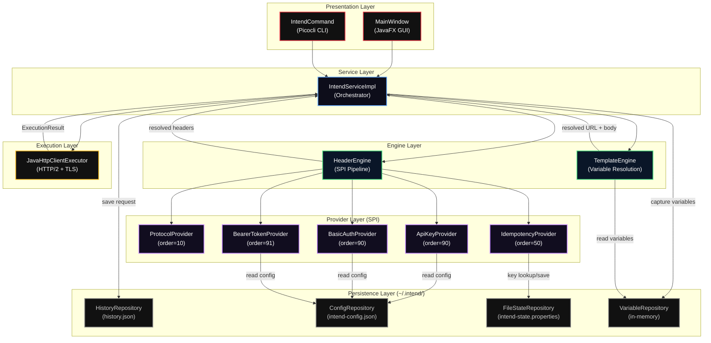
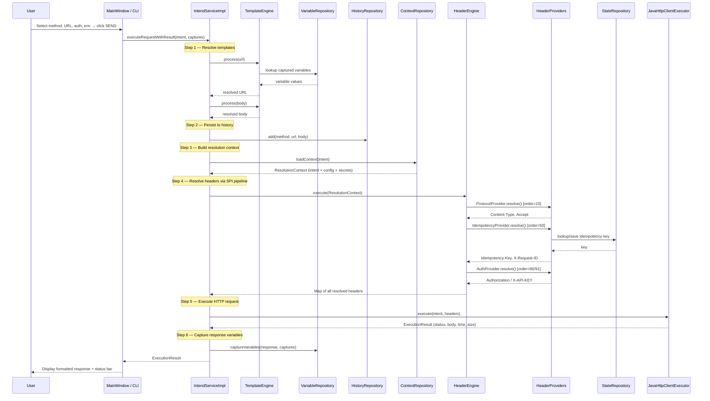
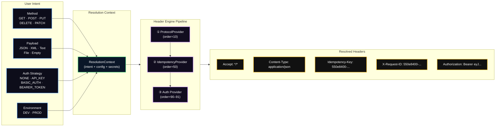

<p align="center">
  
</p>

<h1 align="center">Intend — High-Level Design</h1>

<p align="center">
  <strong>Intent-Driven HTTP API Client</strong><br/>
  <sub>Version 1.0.0 · Java 17 · Spring Boot 3.2 · JavaFX 21</sub>
</p>

---

## Table of Contents

1. [System Overview](#1-system-overview)
2. [Design Philosophy](#2-design-philosophy)
3. [Architecture Layers](#3-architecture-layers)
   - 3.1 [Presentation Layer](#31-presentation-layer)
   - 3.2 [Service Layer](#32-service-layer)
   - 3.3 [Engine Layer](#33-engine-layer)
   - 3.4 [Provider Layer (SPI)](#34-provider-layer-spi)
   - 3.5 [Execution Layer](#35-execution-layer)
   - 3.6 [Persistence Layer](#36-persistence-layer)
4. [Request Lifecycle](#4-request-lifecycle)
5. [Data Flow — Intent to Headers](#5-data-flow--intent-to-headers)
6. [Authentication Architecture](#6-authentication-architecture)
7. [Idempotency Strategy](#7-idempotency-strategy)
8. [Template Engine](#8-template-engine)
9. [Environment Management](#9-environment-management)
10. [Persistence Strategy](#10-persistence-strategy)
11. [Technology Stack](#11-technology-stack)
12. [Non-Functional Requirements](#12-non-functional-requirements)
13. [Future Roadmap](#13-future-roadmap)

---

## 1. System Overview

Intend is an intent-driven HTTP API client that eliminates manual header construction. Users express what they want — an HTTP method, a URL, an authentication strategy, and a payload — and the system resolves all protocol-level headers automatically through a plugin-based header engine.

The application ships as both a **JavaFX desktop workspace** and a **Picocli command-line interface**, unified by a shared service layer orchestrated through Spring Boot.

### System Architecture



---

## 2. Design Philosophy

Intend is built on six non-negotiable principles:

| Principle | Description |
|---|---|
| **Intent, not headers** | Users declare what they want (method, URL, auth strategy, payload). The system derives all protocol headers. No user should ever type `Content-Type` or `Authorization` manually. |
| **Plugin-based resolution (SPI)** | Header resolution is fully delegated to ordered `HeaderProvider` plugins discovered via the SPI pattern. New header logic is added by implementing a single interface — zero changes to the core. |
| **Deterministic behavior** | Given the same intent and configuration, the system produces the same resolved headers every time. Idempotency keys are fingerprinted and reused deterministically. |
| **Inspectable execution** | Every resolved header, every reused key, every template substitution is logged to the console. The user can always trace exactly what the system did. |
| **Offline-first** | All data lives in `~/.intend/`. No cloud sync, no remote authentication, no telemetry. The application works fully without network access (except for the actual HTTP request). |
| **No account required** | There is no sign-up, no login, no license server. Download, run, use. |

---

## 3. Architecture Layers

### 3.1 Presentation Layer

The presentation layer provides two entry points into the same service layer.

| Component | Class | Technology | Responsibility |
|---|---|---|---|
| **GUI** | `MainWindow` | JavaFX 21 | Full workspace: method/URL/auth/env dropdowns, request body editor, response viewer, history sidebar, settings dialog. Bootstrapped via `Launcher` which initializes the JavaFX Application Thread and wires into the Spring context. |
| **CLI** | `IntendCommand` | Picocli 4.7 | Command-line interface accepting `--method`, `--url`, `--auth`, `--body`, `--env` flags. Bootstrapped via `IntendApplication` (Spring Boot `CommandLineRunner`). |

Both presentation components construct a `RequestIntent` record and delegate to `IntendService`.

### 3.2 Service Layer

The service layer is the single orchestrator for all request execution.

**Interface:** `IntendService`
**Implementation:** `IntendServiceImpl`

`IntendServiceImpl` owns the full request lifecycle:

1. Resolve template variables in the URL and body via `TemplateEngine`
2. Persist the request to `HistoryRepository`
3. Load environment context via `ContextRepository`
4. Run the header resolution pipeline via `HeaderEngine`
5. Execute the HTTP request via `RequestExecutor`
6. Capture response variables via `VariableRepository` (if chaining is enabled)
7. Return `ExecutionResult` to the caller

All dependencies are constructor-injected by Spring.

### 3.3 Engine Layer

Two engines handle pre-execution processing:

**HeaderEngine** — Accepts a `ResolutionContext` and runs all registered `HeaderProvider` plugins in ascending order. Each provider that `supports()` the context contributes headers via `resolve()`. Results are merged into a single `Map<String, String>`. Failed resolutions are logged but do not abort the pipeline.

**TemplateEngine** — Scans input strings for `{{placeholder}}` patterns using regex. Built-in generators produce dynamic values (`uuid`, `timestamp`, `randomInt`, `randomEmail`, `randomUser`). Unrecognized placeholders are resolved from `VariableRepository` (captured response values). Unresolved placeholders pass through unchanged.

### 3.4 Provider Layer (SPI)

All providers implement the `HeaderProvider` interface:

```java
public interface HeaderProvider {
    int getOrder();
    boolean supports(ResolutionContext context);
    HeaderResolution resolve(ResolutionContext context);
}
```

Providers are registered in `EngineConfig` and sorted by `getOrder()` ascending:

| Order | Provider | Trigger Condition | Headers Produced |
|---|---|---|---|
| 10 | `ProtocolProvider` | Always | `Content-Type` (auto-detected from payload shape: JSON, XML, plain text, or omitted if empty), `Accept: */*` |
| 50 | `IdempotencyProvider` | Method is `POST`, `PUT`, or `PATCH` | `Idempotency-Key`, `X-Request-ID` |
| 90 | `ApiKeyProvider` | Auth strategy is `API_KEY` | `X-API-KEY` |
| 90 | `BasicAuthProvider` | Auth strategy is `BASIC_AUTH` | `Authorization: Basic <base64(user:pass)>` |
| 91 | `BearerTokenProvider` | Auth strategy is `BEARER_TOKEN` | `Authorization: Bearer <token>` |

The `ResolutionContext` record passed to each provider bundles:
- `RequestIntent intent` — method, URL, payload, auth strategy, env, forceNew flag
- `Map<String, String> config` — environment configuration values
- `Map<String, String> secrets` — credentials for the selected environment

### 3.5 Execution Layer

**Interface:** `RequestExecutor`
**Implementation:** `JavaHttpClientExecutor`

Built on `java.net.http.HttpClient` (Java 11+) with:

| Setting | Value |
|---|---|
| HTTP version | HTTP/2 (with fallback) |
| Redirect policy | `NORMAL` (follow 3xx) |
| Connect timeout | 10 seconds |
| Request timeout | 30 seconds |
| Streaming threshold | 10 MB (responses above this size trigger streaming download to disk) |
| TLS | System default trust store |

Supports three body modes:
- **No body** — `BodyPublishers.noBody()` for GET/DELETE
- **String body** — `BodyPublishers.ofString()` for JSON/XML/text payloads
- **Multipart file upload** — Custom `MultipartUtil` boundary encoding for `File` payloads

Returns an `ExecutionResult` record containing `statusCode`, `body`, `timeMs`, `sizeBytes`, and `statusCategory`.

### 3.6 Persistence Layer

All repositories read/write to `~/.intend/`, resolved by the `DataDir` utility.

| Repository | File | Format | Lifecycle |
|---|---|---|---|
| `HistoryRepository` | `history.json` | JSON array of `HistoryItem` records | Loaded on startup, appended on each request, persisted immediately |
| `ConfigRepository` | `intend-config.json` | JSON object (`ConfigData`) | Loaded on startup, saved when user updates settings |
| `FileStateRepository` | `intend-state.properties` | Java Properties file | Key-value store for idempotency fingerprints |
| `VariableRepository` | *(in-memory)* | `HashMap<String, String>` | Populated by response chaining, cleared on application restart |

---

## 4. Request Lifecycle

The following sequence diagram traces a complete request from user interaction to response display:



---

## 5. Data Flow — Intent to Headers

This diagram shows how user-provided input maps through the engine to produce fully resolved HTTP headers:



---

## 6. Authentication Architecture

Authentication in Intend is declarative. The user selects a strategy from a dropdown — credentials are loaded from the environment configuration, never entered per-request.

### Strategy Resolution

| User Selection | Provider | Config Keys Read | Header Produced |
|---|---|---|---|
| `NONE` | *(no provider activates)* | — | *(no auth header)* |
| `API_KEY` | `ApiKeyProvider` (order=90) | `devKey` or `prodKey` | `X-API-KEY: <value>` |
| `BASIC_AUTH` | `BasicAuthProvider` (order=90) | `BASIC_USER`, `BASIC_PASS` | `Authorization: Basic <base64>` |
| `BEARER_TOKEN` | `BearerTokenProvider` (order=91) | `ACCESS_TOKEN` | `Authorization: Bearer <token>` |

### Design Decisions

- **Per-request strategy selection** — Unlike collection-level auth in Postman/Insomnia, Intend allows the auth strategy to change on every request via the dropdown. The `AuthStrategy` enum is part of the `RequestIntent` record.
- **Credentials isolated by environment** — DEV and PROD maintain separate credential sets in `intend-config.json`. Switching environments automatically changes which credentials are used.
- **Provider guards** — Each auth provider's `supports()` method checks `context.intent().auth()`. Only the matching provider activates. Multiple auth providers can coexist at different order values without conflict.

---

## 7. Idempotency Strategy

Intend automatically protects `POST`, `PUT`, and `PATCH` requests against duplicate processing.

### Fingerprinting

The `IdempotencyProvider` generates a fingerprint by concatenating the HTTP method and URL:

```
fingerprint = METHOD + ":" + URL
```

Example: `POST:https://api.example.com/payments`

### Key Lifecycle

```
┌─────────────────────────────────────────────────────────────┐
│  First request to POST:https://api.example.com/payments     │
│  → No existing key found                                    │
│  → Generate new UUID → save to intend-state.properties      │
│  → Attach as Idempotency-Key + X-Request-ID                 │
├─────────────────────────────────────────────────────────────┤
│  Second request to same fingerprint (forceNew = false)      │
│  → Existing key found in state                              │
│  → Reuse previous key (safe retry semantics)                │
├─────────────────────────────────────────────────────────────┤
│  Request with forceNew = true                               │
│  → Ignore existing key                                      │
│  → Generate fresh UUID → overwrite in state                 │
│  → Attach new key (explicit new transaction)                │
└─────────────────────────────────────────────────────────────┘
```

### Storage

Keys are persisted in `~/.intend/intend-state.properties` via `FileStateRepository`. This ensures keys survive application restarts — a retry after a crash still sends the same idempotency key.

### Headers Produced

| Header | Value | Purpose |
|---|---|---|
| `Idempotency-Key` | UUID v4 | Server-side duplicate detection (Stripe, PayPal, etc.) |
| `X-Request-ID` | Same UUID | Distributed tracing and log correlation |

---

## 8. Template Engine

The `TemplateEngine` resolves `{{placeholder}}` expressions in URLs and request bodies before execution.

### Resolution Order

1. **Built-in generators** — Matched by exact key name. Each invocation produces a fresh value.
2. **Captured variables** — Looked up from `VariableRepository` (populated by response chaining).
3. **Passthrough** — Unresolved placeholders are returned unchanged as `{{key}}`.

### Built-in Generators

| Placeholder | Generator | Example Output |
|---|---|---|
| `{{uuid}}` | `UUID.randomUUID()` | `550e8400-e29b-41d4-a716-446655440000` |
| `{{timestamp}}` | `Instant.now()` (ISO-8601) | `2026-03-02T14:30:00.000Z` |
| `{{randomInt}}` | `Random.nextInt(1000)` | `427` |
| `{{randomEmail}}` | `"user_" + rand + "@example.com"` | `user_3847@example.com` |
| `{{randomUser}}` | `"User" + Random.nextInt(100)` | `User42` |

### Response Chaining

When the **Chain** checkbox is enabled in the GUI, the user defines capture rules in the format `VARIABLE_NAME=/json/pointer`. After execution, `IntendServiceImpl` parses the response body as JSON, evaluates the JSON Pointer, and stores the result in `VariableRepository`. Subsequent requests can reference `{{VARIABLE_NAME}}` in URLs or bodies.

Example:
- Capture rule: `USER_ID=/id`
- Response: `{"id": "abc-123", "name": "Alice"}`
- Stored: `USER_ID = abc-123`
- Next request URL: `https://api.example.com/users/{{USER_ID}}`
- Resolved URL: `https://api.example.com/users/abc-123`

---

## 9. Environment Management

Intend supports two environments — **DEV** and **PROD** — switchable via a dropdown in the GUI or `--env` flag in the CLI.

### Configuration Model

The `ConfigRepository` manages a `ConfigData` object persisted to `~/.intend/intend-config.json`:

```json
{
  "devUrl": "http://localhost:8080",
  "devKey": "",
  "prodUrl": "https://api.example.com",
  "prodKey": ""
}
```

### Resolution Flow

1. User selects an environment (e.g., `PROD`) in the GUI or CLI.
2. The `env` field is set on the `RequestIntent` record.
3. `ContextRepository.loadContext()` reads the matching environment's configuration and credentials from `ConfigRepository`.
4. A `ResolutionContext` record is constructed with:
   - `intent` — the original request intent
   - `config` — environment-specific settings (base URL, etc.)
   - `secrets` — environment-specific credentials (API keys, tokens)
5. This context is passed to the `HeaderEngine`, which forwards it to each provider.

Switching environments changes which credentials are injected — no manual token replacement needed.

---

## 10. Persistence Strategy

All application data is stored locally in the user's home directory under `~/.intend/`. There is no cloud sync, no remote database, and no telemetry.

### File Layout

```
~/.intend/
├── history.json                 # Request history (JSON array)
├── intend-config.json           # Environment configuration (JSON object)
└── intend-state.properties      # Idempotency key store (Java Properties)
```

### Design Rationale

| Decision | Rationale |
|---|---|
| Local filesystem only | Privacy-first. No data leaves the machine. |
| JSON for structured data | Human-readable, editable, debuggable without tools. |
| Java Properties for state | Simple key-value store. No serialization overhead for idempotency fingerprints. |
| In-memory variables | Captured response variables are session-scoped by design. A fresh session starts with a clean variable state. |
| Lazy directory creation | `DataDir.root()` creates `~/.intend/` on first access. No installer-time setup required. |
| No deletion on uninstall | `~/.intend/` persists across installs. Users delete manually if they want a clean slate. |

---

## 11. Technology Stack

| Layer | Technology | Version | Purpose |
|---|---|---|---|
| Runtime | Java (OpenJDK) | 17 | Language and platform |
| Framework | Spring Boot | 3.2.2 | Dependency injection, component scanning, lifecycle management |
| GUI | JavaFX | 21.0.2 | Native desktop UI (controls, FXML, graphics) |
| CLI | Picocli | 4.7.6 | Command-line argument parsing with Spring Boot integration |
| HTTP Client | `java.net.http.HttpClient` | (JDK built-in) | HTTP/2, TLS, async-capable, no external dependency |
| Serialization | Jackson Databind | 2.16.1 | JSON parsing for history, config, and response variable capture |
| Code Generation | Lombok | (provided) | Boilerplate reduction |
| Build | Maven + Maven Wrapper | 3.x | Build, test, package |
| Packaging | jpackage (via `jpackage-maven-plugin`) | 1.6.5 | Native installers: `.dmg` (macOS), `.msi` (Windows), `.deb` / `.rpm` (Linux) |
| Testing | Spring Boot Test + JUnit | (starter) | Unit and integration tests |

---

## 12. Non-Functional Requirements

### Offline Operation

The application is fully functional without internet access. All configuration, history, and state are local. Only the actual HTTP request requires network connectivity.

### Cross-Platform Support

| Platform | Installer | Packaging |
|---|---|---|
| macOS | `.dmg` | `jpackage` with `--type DMG`, `.icns` icon, signed package identifier `com.intend.app` |
| Windows | `.msi` | `jpackage` with `--type MSI`, Start Menu shortcut, per-user install, WiX-based |
| Ubuntu / Debian | `.deb` | `jpackage` with `--type DEB`, desktop shortcut, `Development` menu group |
| Fedora / RHEL | `.rpm` | `jpackage` with `--type RPM`, desktop shortcut, `Development` category |

All platforms receive identical `--add-opens` JVM flags to ensure Spring Boot and JavaFX reflection access on Java 17+.

### Performance Targets

| Metric | Target |
|---|---|
| Application startup (GUI) | < 3 seconds |
| Template resolution | < 1 ms per request |
| Header pipeline execution | < 5 ms per request |
| HTTP connect timeout | 10 seconds |
| HTTP request timeout | 30 seconds |
| Large response streaming | Triggered at > 10 MB |

### Security

- Credentials are stored in `~/.intend/intend-config.json` on the local filesystem with user-level permissions.
- No credentials are logged to console output.
- No telemetry, analytics, or outbound data collection.
- TLS is handled by the JDK's default trust store — no custom certificate pinning.

---

## 13. Future Roadmap

> This section is a placeholder for planned enhancements. Items listed here are not committed and are subject to change.

| Area | Potential Enhancement |
|---|---|
| Authentication | OAuth 2.0 / OIDC provider with token refresh |
| Environments | Support for user-defined custom environments beyond DEV/PROD |
| Collections | Named request collections with import/export |
| Scripting | Pre-request and post-request script hooks |
| Response validation | JSON Schema assertion on responses |
| Plugin discovery | Classpath-based SPI auto-discovery for third-party `HeaderProvider` JARs |
| Proxy support | HTTP/SOCKS proxy configuration |
| Certificate management | Custom CA certificates and client-side mTLS |
| WebSocket | WebSocket connection support in the workspace |
| Export | cURL / HAR export from history |

---

<p align="center">
  
</p>

<p align="center">
  <sub>Copyright 2024 Intend. All rights reserved.</sub>
</p>
