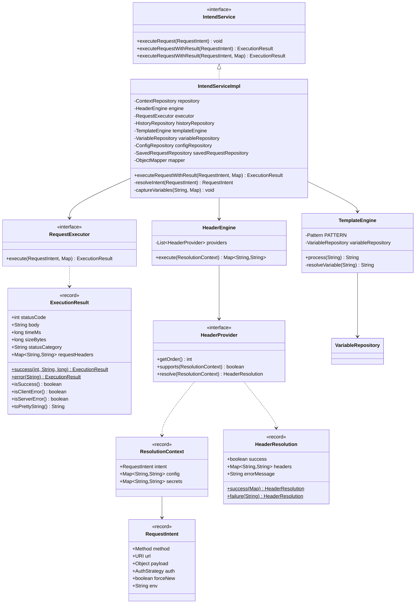
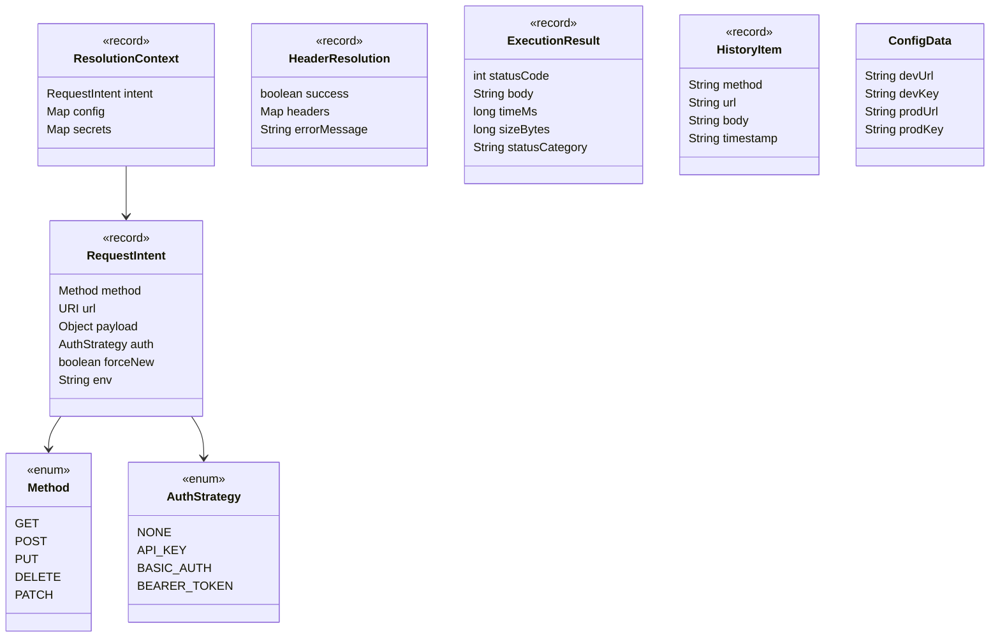
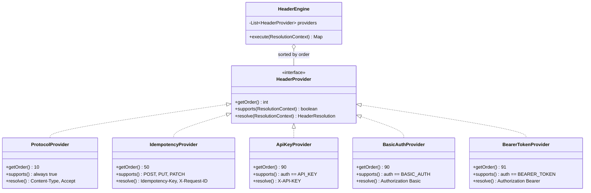
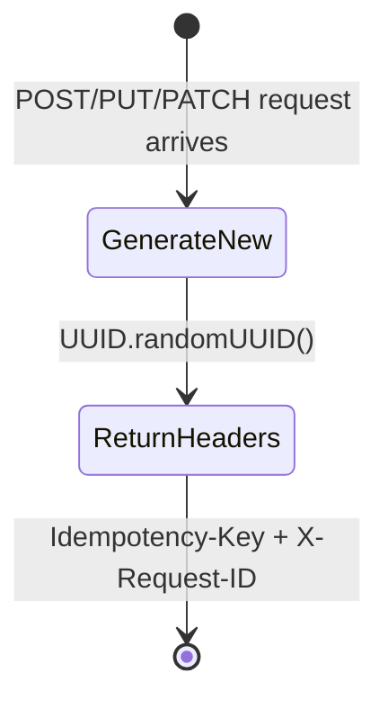
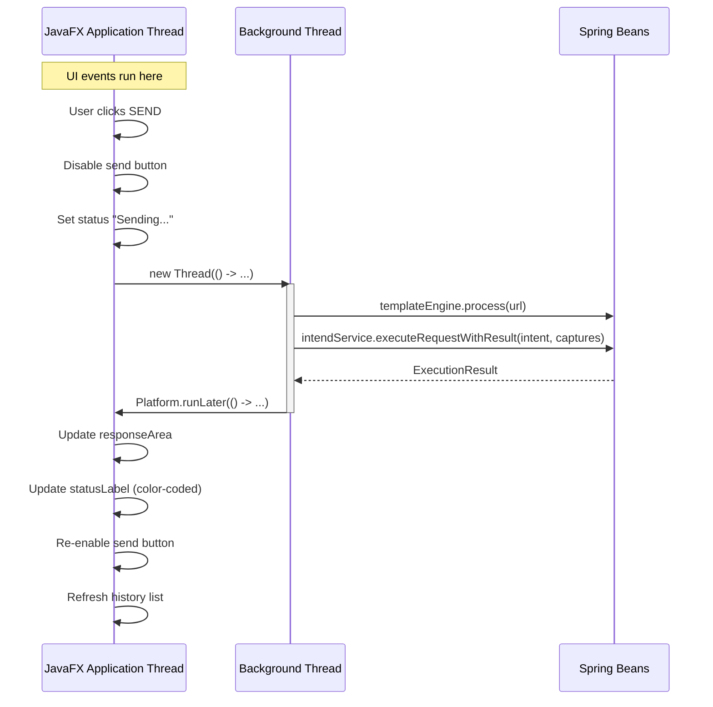
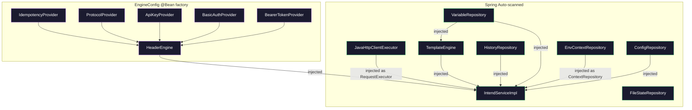

<p align="center">
  
</p>

<h1 align="center">INTEND — Low-Level Design</h1>

<p align="center"><strong>Class-level design, data models, and implementation details</strong></p>

---

## Table of Contents

1. [Class Diagram — Core](#1-class-diagram--core)
2. [Package Breakdown](#2-package-breakdown)
   - [com.intend](#21-comintend)
   - [com.intend.core](#22-comintendcore)
   - [com.intend.context](#23-comintendcontext)
   - [com.intend.spi](#24-comintendspi)
   - [com.intend.engine](#25-comintendengine)
   - [com.intend.providers](#26-comintendproviders)
   - [com.intend.execution](#27-comintendexecution)
   - [com.intend.service](#28-comintendservice)
   - [com.intend.repository](#29-comintendrepository)
   - [com.intend.config](#210-comintendconfig)
   - [com.intend.controller.cli](#211-comintendcontrollercli)
   - [com.intend.ui](#212-comintendui)
3. [Data Models](#3-data-models)
4. [SPI Pattern — Header Provider](#4-spi-pattern--header-provider)
5. [Idempotency State Machine](#5-idempotency-state-machine)
6. [File Format Specifications](#6-file-format-specifications)
7. [Error Handling Strategy](#7-error-handling-strategy)
8. [Thread Model](#8-thread-model)
9. [Dependency Injection Wiring](#9-dependency-injection-wiring)

---

## 1. Class Diagram — Core



---

## 2. Package Breakdown

### 2.1 `com.intend`

#### `IntendApplication`

| Aspect | Detail |
|---|---|
| Annotations | `@SpringBootApplication` |

**`main(String[] args)`**
Calls `SpringApplication.run(IntendApplication.class, args)` 

---

### 2.2 `com.intend.core`

#### `RequestIntent` (record)

The core domain object. Immutable. Represents a single user intent.

| Field | Type | Description |
|---|---|---|
| `method` | `Method` | HTTP method enum |
| `url` | `URI` | Target endpoint |
| `payload` | `Object` | JSON string or `File` for multipart |
| `auth` | `AuthStrategy` | Auth strategy enum |
| `forceNew` | `boolean` | Force new idempotency key |
| `env` | `String` | Target environment (`"dev"` or `"prod"`) |

**`Method` enum:** `GET`, `POST`, `PUT`, `DELETE`, `PATCH`

**`AuthStrategy` enum:** `NONE`, `API_KEY`, `BASIC_AUTH`, `BEARER_TOKEN`

---

### 2.3 `com.intend.context`

#### `ResolutionContext` (record)

Immutable context bundle passed to every `HeaderProvider` during resolution.

| Field | Type | Description |
|---|---|---|
| `intent` | `RequestIntent` | The original user intent |
| `config` | `Map<String,String>` | Environment config (`BASE_URL`, `ENV`) |
| `secrets` | `Map<String,String>` | Credentials (`API_KEY`, `ACCESS_TOKEN`, etc.) |

Created by `EnvContextRepository.loadContext()` based on the selected environment.

---

### 2.4 `com.intend.spi`

#### `HeaderProvider` (interface)

The SPI contract. Every header-contributing component implements this.

```java
public interface HeaderProvider {
    int getOrder();                              // execution priority (lower = first)
    boolean supports(ResolutionContext context);  // should this provider run?
    HeaderResolution resolve(ResolutionContext context); // produce headers
}
```

#### `HeaderResolution` (record)

Result of a provider's `resolve()` call.

| Field | Type | Description |
|---|---|---|
| `success` | `boolean` | Whether resolution succeeded |
| `headers` | `Map<String,String>` | Resolved headers (empty on failure) |
| `errorMessage` | `String` | Error description (null on success) |

**Factory methods:**
- `HeaderResolution.success(Map<String,String> headers)` — creates a successful resolution
- `HeaderResolution.failure(String message)` — creates a failed resolution with `Map.of()` headers

---

### 2.5 `com.intend.engine`

#### `HeaderEngine`

The central resolution engine. Runs all registered `HeaderProvider` plugins in priority order.

| Aspect | Detail |
|---|---|
| Fields | `List<HeaderProvider> providers` (sorted by order, ascending) |
| Constructor | Receives unsorted list, sorts via `Comparator.comparingInt(HeaderProvider::getOrder)`, stores as immutable list |

**`execute(ResolutionContext context) → Map<String,String>`**

```
1. Create empty LinkedHashMap (preserves insertion order)
2. For each provider in sorted order:
   a. Call provider.supports(context)
   b. If true → call provider.resolve(context)
   c. If resolution.success() → putAll headers into map
   d. If failed → print error to stderr
3. Return accumulated headers map
```

Headers from later providers overwrite earlier ones if keys collide (e.g., two providers setting `Authorization`).

#### `TemplateEngine`

Resolves `{{variable}}` placeholders in URLs and request bodies.

| Aspect | Detail |
|---|---|
| Annotations | `@Component` |
| Fields | `Pattern PATTERN = \{\{([^}]+)\}\}`, `Random random`, `VariableRepository variableRepository` |

**`process(String input) → String`**

Returns input unchanged if null or empty. Otherwise uses `Matcher.find()` loop with `appendReplacement` to resolve each placeholder.

**`resolveVariable(String key) → String`** (private)

| Key | Resolution |
|---|---|
| `"uuid"` | `UUID.randomUUID().toString()` |
| `"timestamp"` | `Instant.now().toString()` |
| `"randomInt"` | `String.valueOf(random.nextInt(1000))` |
| `"randomEmail"` | `"user_" + random.nextInt(9999) + "@example.com"` |
| `"randomUser"` | `"User" + random.nextInt(100)` |
| anything else | Falls through to `resolveStoredVariable(key)` |

**`resolveStoredVariable(String key) → String`** (private)

Checks `variableRepository.get(key)`. If found, returns the stored value. If not found, returns the original `"{{key}}"` placeholder unchanged.

---

### 2.6 `com.intend.providers`

#### Provider Summary

| Class | Order | Supports | Headers Produced |
|---|---|---|---|
| `ProtocolProvider` | 10 | Always | `Accept`, `Content-Type` |
| `IdempotencyProvider` | 50 | POST, PUT, PATCH | `Idempotency-Key`, `X-Request-ID` |
| `ApiKeyProvider` | 90 | auth == API_KEY | `X-API-KEY` |
| `BasicAuthProvider` | 90 | auth == BASIC_AUTH | `Authorization: Basic` |
| `BearerTokenProvider` | 91 | auth == BEARER_TOKEN | `Authorization: Bearer` |

#### `ProtocolProvider`

**`supports()`** — Always returns `true`. Runs on every request.

**`resolve()`** logic:

```
1. Always add: Accept → */*
2. Check payload:
   - null or empty → no Content-Type
   - starts with { or [ → Content-Type: application/json
   - starts with < → Content-Type: application/xml
   - anything else → Content-Type: text/plain
3. Return headers
```

#### `IdempotencyProvider`

**Constructor:** Receives `StateRepository` for key persistence.

**`supports()`** — Returns true when method is `POST`, `PATCH`, or `PUT`.

**`resolve()`** logic:

```
1. Generate new UUID via UUID.randomUUID()
2. Return {Idempotency-Key: uuid, X-Request-ID: uuid}
```

Both `Idempotency-Key` and `X-Request-ID` always carry the same UUID value.

#### `ApiKeyProvider`

**`supports()`** — Returns true when `auth == API_KEY`.

**`resolve()`** — Reads `API_KEY` from `context.secrets()`. Defaults to `"MISSING_KEY"`. Returns `X-API-KEY` header.

#### `BasicAuthProvider`

**`supports()`** — Returns true when `auth == BASIC_AUTH`.

**`resolve()`** — Reads `BASIC_USER` (default `"admin"`) and `BASIC_PASS` (default `"password"`) from secrets. Encodes `user:pass` as Base64. Returns `Authorization: Basic <encoded>`.

#### `BearerTokenProvider`

**`supports()`** — Returns true when `auth == BEARER_TOKEN`.

**`resolve()`** — Reads `ACCESS_TOKEN` from secrets. Falls back to a mock token string if null. Returns `Authorization: Bearer <token>`.

---

### 2.7 `com.intend.execution`

#### `RequestExecutor` (interface)

```java
public interface RequestExecutor {
    ExecutionResult execute(RequestIntent intent, Map<String, String> headers);
}
```

#### `ExecutionResult` (record)

| Field | Type | Description |
|---|---|---|
| `statusCode` | `int` | HTTP status code (0 for connection errors) |
| `body` | `String` | Response body or error message |
| `timeMs` | `long` | Round-trip time in milliseconds |
| `sizeBytes` | `long` | Response body size in bytes |
| `statusCategory` | `String` | Human-readable category |
| `requestHeaders` | `Map<String, String>` | The exact headers ultimately produced and sent over the wire |

**Factory methods:**

| Method | Behavior |
|---|---|
| `success(int code, String body, long timeMs)` | Computes sizeBytes from UTF-8, calls `categorise(code)` |
| `error(String message)` | Returns statusCode=0, timeMs=0, sizeBytes=0, category="Error" |

**`categorise(int code)`:**

| Range | Category |
|---|---|
| 200–299 | `"Success"` |
| 300–399 | `"Redirect"` |
| 400–499 | `"Client Error"` |
| 500+ | `"Server Error"` |
| other | `"Unknown"` |

**`formatSize(long bytes)`:**

| Range | Format | Example |
|---|---|---|
| < 1024 | `bytes + " B"` | `742 B` |
| < 1 MB | `%.1f KB` | `12.3 KB` |
| >= 1 MB | `%.1f MB` | `2.4 MB` |

**`toPrettyString()`** output format:

```
Status: 200 (Success)
Time:   142 ms
Size:   1.3 KB
Body:
{"id": "abc-123"}
```

#### `JavaHttpClientExecutor`

| Aspect | Detail |
|---|---|
| Annotations | `@Component` |
| Constants | `CONNECT_TIMEOUT = 10s`, `REQUEST_TIMEOUT = 30s`, `STREAM_THRESHOLD = 10 MB` |
| HttpClient config | HTTP/2, `Redirect.NORMAL`, 10s connect timeout |

**`execute(RequestIntent intent, Map<String,String> headers) → ExecutionResult`**

```
1. Build HttpRequest with URI and 30s timeout
2. Copy headers into a mutable map
3. Resolve body publisher:
   - payload instanceof File → MultipartUtil, set Content-Type with boundary
   - payload is String → BodyPublishers.ofString
   - payload is null → BodyPublishers.noBody
4. Set headers on builder (skip Content-Type to avoid overwriting multipart boundary)
5. Set method + body publisher
6. Record start time via System.nanoTime()
7. Send request with BodyHandlers.ofString()
8. Calculate elapsed time in ms
9. Warn if response > STREAM_THRESHOLD
10. Return ExecutionResult.success()
```

**Exception handling:** See [Section 7](#7-error-handling-strategy).

**`executeStreaming(RequestIntent, Map, Path destination) → ExecutionResult`**

For large file downloads. Uses `BodyHandlers.ofInputStream()`, pipes to `Files.copy()`, 5-minute timeout. Returns the file path and byte count in the result body.

---

### 2.8 `com.intend.service`

#### `IntendService` (interface)

```java
void executeRequest(RequestIntent intent);
ExecutionResult executeRequestWithResult(RequestIntent intent);
ExecutionResult executeRequestWithResult(RequestIntent intent, Map<String, String> captures);
```

#### `IntendServiceImpl`

| Aspect | Detail |
|---|---|
| Annotations | `@Service` |
| Injected | `ContextRepository`, `HeaderEngine`, `RequestExecutor`, `HistoryRepository`, `TemplateEngine`, `VariableRepository`, `ConfigRepository`, `SavedRequestRepository` |

**`executeRequestWithResult(RequestIntent intent, Map<String,String> captures)`**

This is the primary orchestration method. Full flow:

```
1. resolveIntent(intent)
   a. Process payload through TemplateEngine (File payloads pass through unchanged)
   b. Process URL through TemplateEngine
   c. Create new RequestIntent with resolved URL + body

2. historyRepository.add(method, url, body)

3. repository.loadContext(resolvedIntent)
   → Returns ResolutionContext with config + secrets for the target env

4. engine.execute(context)
   → Runs all HeaderProviders, returns resolved headers map

5. executor.execute(resolvedIntent, headers)
   → Sends HTTP request, returns ExecutionResult

6. captureVariables(result.body, captures)
   → If statusCode > 0 and captures is not null/empty:
      a. Parse response body as JSON (Jackson ObjectMapper)
      b. For each capture entry (key → jsonPointer):
         - Use JsonNode.at(jsonPointer) to extract value
         - Store in variableRepository.put(key, value)

7. Return ExecutionResult
```

---

### 2.9 `com.intend.repository`

#### `DataDir` (utility)

| Aspect | Detail |
|---|---|
| Constant | `DIR_NAME = ".intend"` |
| Location | `System.getProperty("user.home") + "/.intend/"` |

**`root()`** — Returns the `~/.intend/` directory, creating it via `mkdirs()` if it doesn't exist.

**`resolve(String fileName)`** — Returns `new File(root(), fileName)`.

#### `HistoryRepository`

| Aspect | Detail |
|---|---|
| Annotations | `@Repository` |
| File | `~/.intend/history.json` |
| Cache | `ArrayList<HistoryItem>` (in-memory) |

**`HistoryItem` record:** `String method, String url, String body, String timestamp`

| Method | Behavior |
|---|---|
| Constructor | Calls `load()` — reads JSON array from file into cache |
| `add(method, url, body)` | Prepends new item (index 0) with `dd MMM yyyy, HH:mm:ss` timestamp, calls `save()` |
| `getAll()` | Returns a defensive copy of the cache |
| `delete(item)` | Removes from cache, calls `save()` |
| `save()` | Writes cache to file via Jackson pretty printer |
| `load()` | Reads file as `List<HistoryItem>` via Jackson TypeReference |

#### `ConfigRepository`

| Aspect | Detail |
|---|---|
| Annotations | `@Repository` |
| File | `~/.intend/intend-config.json` |

**`ConfigData` class:**

| Field | Type | Default |
|---|---|---|
| `devUrl` | `String` | `"http://localhost:8080"` |
| `devKey` | `String` | `""` |
| `prodUrl` | `String` | `"https://api.example.com"` |
| `prodKey` | `String` | `""` |

| Method | Behavior |
|---|---|
| Constructor | Calls `load()` |
| `get()` | Returns cached `ConfigData` |
| `save(devUrl, devKey, prodUrl, prodKey)` | Updates cache fields, writes to file |

#### `VariableRepository`

| Aspect | Detail |
|---|---|
| Annotations | `@Repository` |
| Storage | `HashMap<String,String>` (in-memory only, not persisted) |

| Method | Behavior |
|---|---|
| `put(key, value)` | Stores variable, prints confirmation to stdout |
| `get(key)` | Returns value or null |
| `getAll()` | Returns defensive copy |

Variables are lost when the application exits. They exist only for the current session.

#### `ContextRepository` (interface)

```java
ResolutionContext loadContext(RequestIntent intent);
```

#### `EnvContextRepository`

| Aspect | Detail |
|---|---|
| Annotations | `@Repository` |
| Injected | `ConfigRepository` |

**`loadContext(RequestIntent intent)`:**

| Environment | config map | secrets map |
|---|---|---|
| `"prod"` | `{BASE_URL: prodUrl, ENV: "prod"}` | `{API_KEY: prodKey}` |
| anything else | `{BASE_URL: devUrl, ENV: "dev"}` | `{API_KEY: devKey}` |

#### `StateRepository` (interface)

```java
String getLastIdempotencyKey(String key);
void saveIdempotencyKey(String key, String uuid);
```

#### `FileStateRepository`

| Aspect | Detail |
|---|---|
| Annotations | `@Repository` |
| File | `~/.intend/intend-state.properties` |
| Storage | `java.util.Properties` |

| Method | Behavior |
|---|---|
| Constructor | Calls `load()` — reads properties file if it exists |
| `getLastIdempotencyKey(key)` | Returns `props.getProperty(key)` |
| `saveIdempotencyKey(key, uuid)` | Sets property, immediately writes to disk |

---

### 2.10 `com.intend.config`

#### `EngineConfig`

| Aspect | Detail |
|---|---|
| Annotations | `@Configuration` |

**`@Bean headerEngine()`:**

Manually instantiates all five providers and passes them to `HeaderEngine`:

```java
List<HeaderProvider> providers = List.of(
    new ProtocolProvider(),          // order 10
    new ApiKeyProvider(),            // order 90
    new BasicAuthProvider(),         // order 90
    new BearerTokenProvider(),       // order 91
    new IdempotencyProvider()        // order 50
);
return new HeaderEngine(providers);
```

Note: The list order here doesn't matter — `HeaderEngine` re-sorts by `getOrder()` in its constructor.

---

### 2.11 `com.intend.ui`

#### `Launcher`

```java
public static void main(String[] args) {
    Application.launch(MainWindow.class, args);
}
```

Entry point for GUI mode. Bypasses `IntendApplication` entirely — launches JavaFX directly.

#### `MainWindow`

| Aspect | Detail |
|---|---|
| Extends | `javafx.application.Application` |
| Spring integration | Bootstraps its own `ConfigurableApplicationContext` via `SpringApplicationBuilder` in `init()` |
| Key beans | `IntendServiceImpl`, `TemplateEngine` (retrieved from Spring context) |

**Lifecycle:**

| Method | What happens |
|---|---|
| `init()` | Creates Spring context, retrieves `IntendServiceImpl` and `TemplateEngine` beans |
| `start(Stage)` | Builds entire UI, attaches event handlers, shows window |
| `stop()` | Closes Spring `applicationContext` |

**UI Component hierarchy:**

```
SplitPane (horizontal, divider at 0.3)
├── VBox (sidebar)
│   ├── ImageView (logo)
│   ├── Label "HISTORY"
│   └── ListView<HistoryItem> (custom ListCell)
└── VBox (mainContent)
    ├── VBox (topBar)
    │   ├── HBox (controlsBar: icon, settings, toggle, method, auth, env)
    │   └── HBox (urlBar: urlField, sendBtn)
    ├── VBox (requestSection)
    │   ├── Label "REQUEST"
    │   ├── HBox (fileSection: attachBtn, clearBtn, fileLabel)
    │   ├── TextArea (requestBody)
    │   └── VBox (captureSection: chainToggle, captureField)
    └── VBox (responseSection)
        ├── Label "RESPONSE"
        ├── TextArea (responseArea, read-only)
        └── Label (statusLabel)
```

**Send button handler (background thread):**

```
1. Disable send button, set status to "Sending..."
2. Spawn new Thread:
   a. Read URL from urlField, process through TemplateEngine
   b. Validate no unresolved {{variables}} remain
   c. Build payload: selectedFile if attached, else requestBody text
   d. Create RequestIntent from ComboBox values
   e. Build captures map from captureField text
   f. Call intendService.executeRequestWithResult(intent, captures)
   g. Pretty-print response body if JSON
   h. Platform.runLater:
      - Set responseArea text
      - Update status label (color-coded)
      - Re-enable send button
      - Refresh history list
```

**History ListCell rendering:**

| Method label color | Method |
|---|---|
| `#4ADE80` (green) | GET |
| `#60A5FA` (blue) | POST |
| `#FBBF24` (yellow) | PUT |
| `#FF3B3B` (red) | DELETE |
| `#C084FC` (purple) | PATCH |

**Status label color coding:**

| Status range | Color |
|---|---|
| 200–299 | `#4ADE80` (green) |
| 400+ | `#FF3B3B` (red) |
| other | `#FBBF24` (yellow) |

**Settings window:**

Opens a new `Stage` with a `GridPane` containing `TextField`/`PasswordField` for dev URL, dev key, prod URL, prod key. Save button calls `configRepository.save()` and closes the window.

---

## 3. Data Models

### Core Records



---

## 4. SPI Pattern — Header Provider



---

## 5. Idempotency State Machine



---

## 6. File Format Specifications

### `~/.intend/history.json`

JSON array, most recent entry first:

```json
[
  {
    "method": "POST",
    "url": "https://api.example.com/users",
    "body": "{\"name\": \"Alice\"}",
    "timestamp": "14:32:01"
  },
  {
    "method": "GET",
    "url": "https://jsonplaceholder.typicode.com/posts/1",
    "body": "",
    "timestamp": "14:30:45"
  }
]
```

- Timestamp format: `dd MMM yyyy, HH:mm:ss` (local time)
- New entries are prepended (index 0)
- Written by Jackson `writerWithDefaultPrettyPrinter()`

### `~/.intend/intend-config.json`

```json
{
  "devUrl": "http://localhost:8080",
  "devKey": "dev-api-key-here",
  "prodUrl": "https://api.yourcompany.com",
  "prodKey": "prod-api-key-here"
}
```

- Fields have defaults if file doesn't exist (see `ConfigData`)
- Written by Jackson pretty printer on every save

### `~/.intend/intend-state.properties`

Standard Java properties format:

```properties
# Intend Execution State
POST\:https\://api.example.com/payments=550e8400-e29b-41d4-a716-446655440000
PUT\:https\://api.example.com/users/123=7c9e6679-7425-40de-944b-e07fc1f90ae7
```

- Keys are escaped fingerprints (`METHOD:URL`)
- Values are UUID strings
- Written via `Properties.store()` on every idempotency key change

---

## 7. Error Handling Strategy

`JavaHttpClientExecutor` catches specific exceptions and maps each to a descriptive `ExecutionResult.error()`:

| Exception | Error Message | Cause |
|---|---|---|
| `HttpTimeoutException` | `"Request timed out after 30s."` | Server didn't respond within timeout |
| `ConnectException` | `"Connection refused — is the server running? (hostname)"` | Server not accepting connections |
| `UnknownHostException` | `"Unknown host: hostname"` | DNS resolution failed |
| `SSLException` | `"SSL/TLS error: <message>"` | Certificate or TLS handshake failure |
| `IllegalArgumentException` | `"Invalid URL: <message>"` | Malformed URI |
| `InterruptedException` | `"Request interrupted."` | Thread interrupted (also re-interrupts thread) |
| `Exception` (catch-all) | `"Network error: <message>"` | Any other I/O or network failure |

All error results have `statusCode = 0`, `timeMs = 0`, `sizeBytes = 0`, `statusCategory = "Error"`.

---

## 8. Thread Model



**Rules:**
- All UI reads/writes happen on the JavaFX Application Thread
- HTTP calls happen on a dedicated background thread (one per SEND click)
- `Platform.runLater()` bridges results back to the FX thread
- Spring beans are thread-safe for this use case (no shared mutable state in the request path, except `VariableRepository` which is only written from background threads and read from background threads)

---

## 9. Dependency Injection Wiring

### Spring-managed beans (`@Component`, `@Repository`, `@Service`)

| Bean | Annotation | Scope |
|---|---|---|
| `IntendApplication` | `@SpringBootApplication` | Singleton |
| `IntendCommand` | `@Component` | Singleton |
| `IntendServiceImpl` | `@Service` | Singleton |
| `JavaHttpClientExecutor` | `@Component` | Singleton |
| `TemplateEngine` | `@Component` | Singleton |
| `HistoryRepository` | `@Repository` | Singleton |
| `ConfigRepository` | `@Repository` | Singleton |
| `VariableRepository` | `@Repository` | Singleton |
| `EnvContextRepository` | `@Repository` | Singleton |
| `FileStateRepository` | `@Repository` | Singleton |

### Manually instantiated in `EngineConfig` (`@Configuration`)

| Class | Reason |
|---|---|
| `ProtocolProvider` | No Spring dependencies |
| `ApiKeyProvider` | No Spring dependencies |
| `BasicAuthProvider` | No Spring dependencies |
| `BearerTokenProvider` | No Spring dependencies |
| `IdempotencyProvider` | Receives `StateRepository` via `@Bean` method parameter |
| `HeaderEngine` | Receives the ordered provider list |

**Why manual?** The providers are simple value objects with no dependencies on Spring infrastructure.



---

<p align="center">
  
</p>

<p align="center">
  <strong>Built with intent.</strong><br/>
  <sub>Copyright 2024 Intend. All rights reserved.</sub>
</p>
