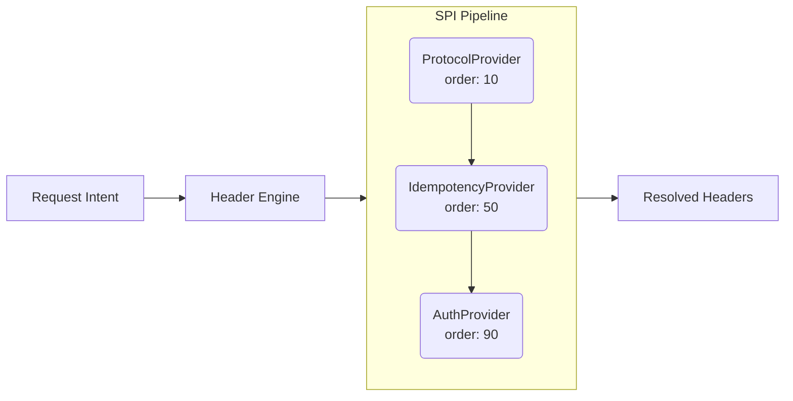

# Architecture & Under the Hood

Intend is built upon a layered execution pipeline that strictly separates the *User Intent* from the *Protocol Implementation*.

When you interact with the UI, you are actually building an immutable `RequestIntent` record containing the exact parameters you specified in the dropdowns. This record is completely decoupled from standard HTTP libraries.

## The Service Orchestrator

The `IntendServiceImpl` sits at the heart of the application, orchestrating the journey of your request from intent to execution. 

1. **Template Resolution:** It first passes your intent through the `TemplateEngine` to resolve any `{{variables}}` embedded in your URL or request payload.
2. **Context Assembly:** It fetches your Dev/Prod environment configuration from the `ConfigRepository`.
3. **Engine Compiling:** It maps all of this state into a `ResolutionContext` and hands it off to the **Header Engine**.

## The Header Engine (SPI Layer)

The true power of Intend lies in its Service Provider Interface (SPI) Header Implementation Pipeline. 

Instead of a monolithic blob of `if/else` logic dictating how HTTP headers behave, Intend resolves all headers via independent, ordered `HeaderProvider` plugins.

When the Engine executes:
1. The **ProtocolProvider** (Order 10) spins up and dynamically decides your `Accept` and `Content-Type` headers based on your payload analysis. It also injects dynamic browser fingerprints (like `User-Agent` and `Sec-Fetch-*`) designed to gracefully bypass CDN strict-origin checks.
2. The **IdempotencyProvider** (Order 50) determines if your method requires idempotency safety (`POST`/`PUT`/`PATCH`) and injects unique tracing UUIDs.
3. The **Auth Providers** (Order 90+) inject credentials for your specific auth strategy.

This execution loop takes under **5 milliseconds**.

## HTTP/2 Execution Layer

Once the Intent is translated into a pristine set of HTTP Headers, the payload is handed to the `JavaHttpClientExecutor`. Written atop modern, native Java 11+ non-blocking `java.net.http.HttpClient` APIs, it automatically negotiates HTTP/2 streaming or HTTP/1.1 fallbacks effortlessly.
