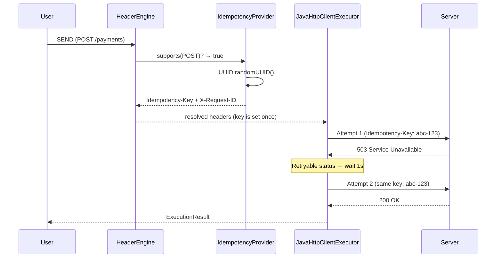

# Idempotency Strategy

Duplicate protection is arguably the most critical component of live infrastructure testing. Executing the same Stripe `POST` charge twice because of a network timeout can be catastrophic.

Intend inherently prevents this via a two-layer architecture: the `IdempotencyProvider` generates a fresh key for each explicit intent, and the `JavaHttpClientExecutor` preserves this exact key across automatic network retries.

## How It Works

Every **POST**, **PUT**, or **PATCH** request automatically receives two headers — both carrying the same UUID:

- `Idempotency-Key` — prevents duplicate processing on the server
- `X-Request-ID` — correlates the request across distributed systems

`GET` and `DELETE` requests are excluded — they are inherently idempotent and receive no key.

## Layer 1 — Key Generation (`IdempotencyProvider`)

Registered at **order 50** in the `HeaderEngine`, the provider implements the `HeaderProvider` SPI:

```java
public class IdempotencyProvider implements HeaderProvider {

    @Override public int getOrder() { return 50; }

    @Override
    public boolean supports(ResolutionContext ctx) {
        String method = ctx.intent().method().name();
        return method.equals("POST") || method.equals("PATCH") || method.equals("PUT");
    }

    @Override
    public HeaderResolution resolve(ResolutionContext ctx) {
        String key = UUID.randomUUID().toString();
        return HeaderResolution.success(Map.of(
            "Idempotency-Key", key,
            "X-Request-ID", key
        ));
    }
}
```

Every new request gets a **fresh UUID v4**. There is no cached or stale key reuse across separate user actions — each click of SEND is treated as a new intent.

## Layer 2 — Retry Safety (`JavaHttpClientExecutor`)

The executor wraps the HTTP call in a retry loop (up to **2 retries**, 3 total attempts). The critical design: the resolved headers map — including the `Idempotency-Key` — is created **once before the loop** and reused across all retry attempts:

```java
Map<String, String> requestHeaders = new HashMap<>(headers); // Idempotency-Key is already set

for (int attempt = 0; attempt <= MAX_RETRIES; attempt++) {
    // same requestHeaders (same Idempotency-Key) on every attempt
    if (isRetryableStatus(status) && attempt < MAX_RETRIES) {
        continue; // retry with identical key
    }
}
```

**Retryable conditions** (automatic retry with the same key):
- HTTP `502 Bad Gateway`, `503 Service Unavailable`, `504 Gateway Timeout`
- `HttpTimeoutException` (read timeout)
- `ConnectException` (TCP connection failure)

**Non-retryable conditions** (fail immediately):
- `UnknownHostException` — DNS resolution failure
- `SSLException` — TLS/certificate errors
- `IllegalArgumentException` — malformed URL

Retry delay uses **linear backoff**: `1s × attempt number` (1s, then 2s).

## End-to-End Flow



1. User clicks **SEND** on a POST request
2. `IdempotencyProvider.resolve()` generates a fresh UUID → injected as both `Idempotency-Key` and `X-Request-ID`
3. `JavaHttpClientExecutor` sends the request with the resolved headers
4. If the server returns 502/503/504 or the connection times out → the executor **retries with the same headers** (same key)
5. On success or after exhausting retries → the result is returned to the UI

This provides out-of-the-box Stripe-style idempotency locally without any manual coordination or configuration.
